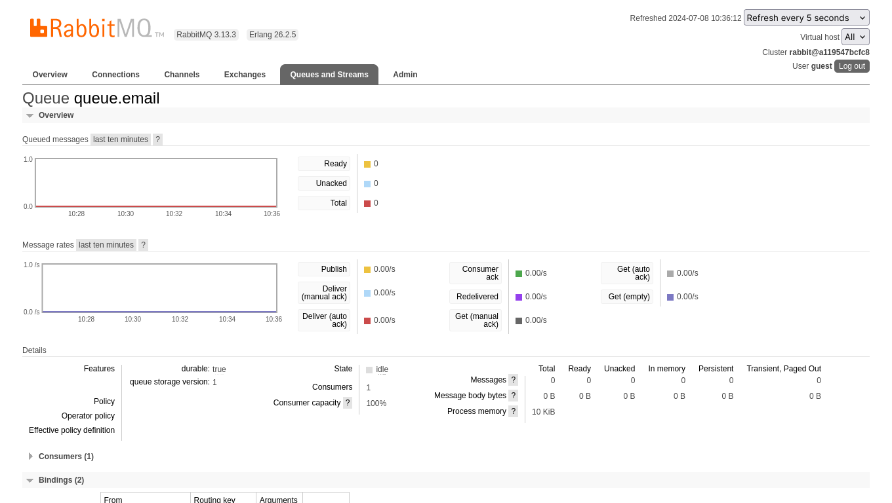

## Take-home Microservices Challenge
This is how we faced the challenge of creating a notification email services

## _Table of contents_
- [Take-home Microservices Challenge](#take-home-microservices-challenge)
- [_Table of contents_](#table-of-contents)
- [_Overview_](#overview)
- [_Screenshot_](#screenshot)
- [_Links_](#links)
- [_Built with_](#built-with)
- [_How I did it_](#how-i-did-it)
- [_Continued development_](#continued-development)
  - [_Useful resources_](#useful-resources)
- [_Author_](#author)
- [Acknowledgments](#acknowledgments)
## _Overview_
The design is structured as shown:
-  src|
    - main
    - java|
        - com/xxx/challenge/notificationEmailService|
            - config
            - dto
            - consumer
            - service
        - test
## _Screenshot_
[]()
## _Links_
- Service Socket: [AMQChannel(amqp://guest@127.0.0.1:5672/,1),] 
## _Built with_

[](https://skillicons.dev)


 ## _How I did it_
```java
package com.xxxx.challenge.notificationEmailService.service;

import org.springframework.beans.factory.annotation.Autowired;
import org.springframework.mail.SimpleMailMessage;
import org.springframework.mail.javamail.JavaMailSender;
import org.springframework.stereotype.Service;

@Service
public class MessageNotificationEmailService {


  @Autowired
  private JavaMailSender mailSender;
  
  public void sendNewMail(String to, String subject, String body) {

    SimpleMailMessage message = new SimpleMailMessage();
    message.setTo(to);
    message.setSubject(subject);
    message.setText(body);

    mailSender.send(message);
  }
}

``` 

## _Continued development_
- maybe
### _Useful resources_
- [https://angular.io] Build user interfaces out of individual pieces called components!.

## _Author_
- Website - [https://ferreiras.dev.br] 
## Acknowledgments
- 
